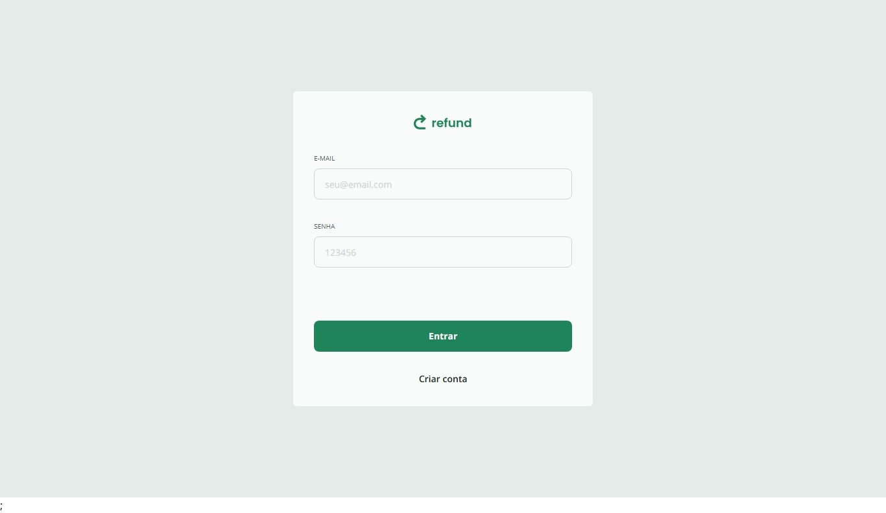
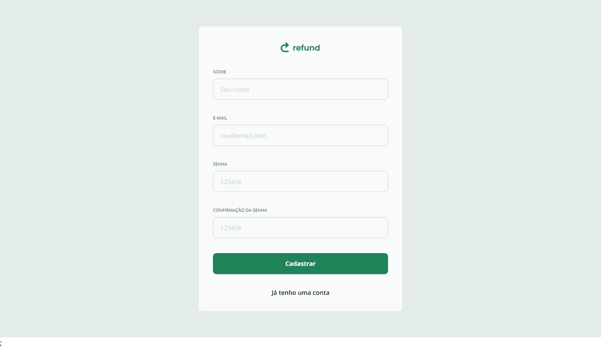
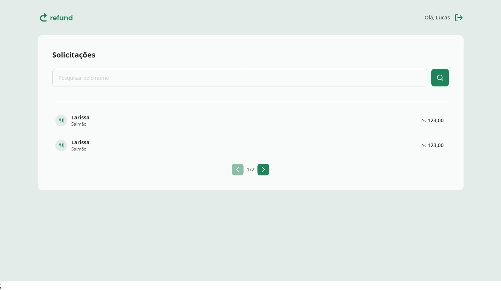
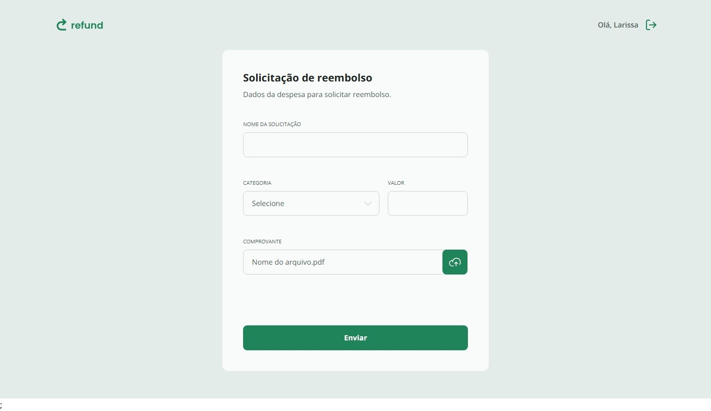
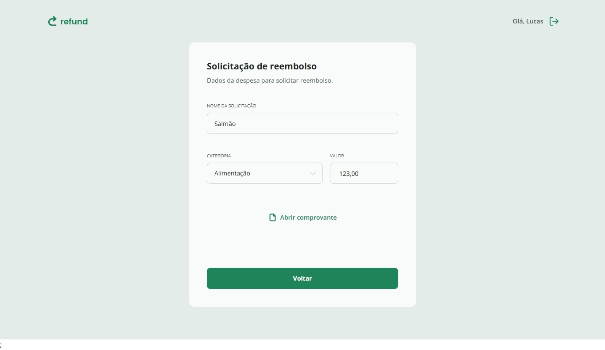
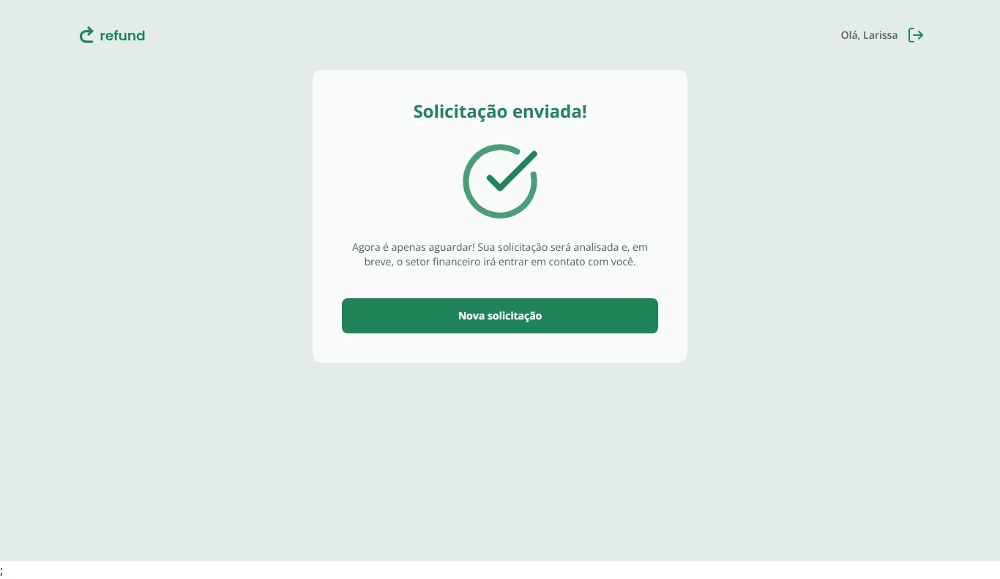

<h1 align="center">Refund Web</h1>

<p align="center">
	Frontend da aplicação de reembolso desenvolvido com React + TypeScript.
</p>

<p align="center">
	Projeto criado durante o curso Fullstack da Rocketseat, com melhorias e decisões adicionais implementadas por <strong>Lucas Moura</strong>.
</p>

## Sobre o projeto

O **Refund Web** é a interface de um sistema de solicitação e gestão de reembolsos, com autenticação, permissões por perfil e fluxo completo de criação e visualização de solicitações.

### Funcionalidades principais

- Autenticação com persistência de sessão
- Rotas por perfil de usuário (`employee` e `manager`)
- Cadastro e login
- Criação de solicitação de reembolso com upload de comprovante
- Listagem de solicitações com busca e paginação
- Visualização de comprovante em solicitações existentes
- Estados de loading e tratamento de erros de API

## Screenshots

As imagens abaixo mostram o fluxo principal da aplicação, do acesso inicial até a finalização de uma solicitação.

### 1. Login



### 2. Cadastro



### 3. Dashboard



### 4. Nova solicitação



### 5. Detalhe da solicitação



### 6. Solicitação enviada



## Stack utilizada

- React 19
- TypeScript
- Vite
- React Router
- React Hook Form
- Zod
- Axios
- Tailwind CSS v4

## Estrutura de pastas

```text
src/
	components/
	contexts/
	dtos/
	hooks/
	pages/
	routes/
	services/
	utils/
```

## Como rodar o projeto

### Pré-requisitos

- Node.js 20+ (recomendado)
- npm

### 1. Instalar dependências

```bash
npm install
```

### 2. Configurar URL da API

Crie um arquivo `.env` na raiz do projeto com a URL da sua API.

```env
VITE_API_URL=http://localhost:3333
```

Você pode usar o arquivo `.env.example` como base para configurar outro ambiente.

No código, a aplicação lê essa variável em `src/services/api.ts`.

### 3. Rodar em desenvolvimento

```bash
npm run dev
```

### 4. Build de produção

```bash
npm run build
```

### 5. Preview do build

```bash
npm run preview
```

## API (backend)

- Repositório/API URL: [RefundAPI](https://github.com/keewonf/RefundAPI)

## Melhorias implementadas

Além da base do curso, foram aplicadas melhorias como:

- Debounce na busca com opção de disparo imediato pelo botão
- Correções de paginação em mudanças de termo de busca
- Tratamento de mensagens de erro de API para feedback ao usuário

## Autor

**Lucas Moura**

- GitHub: [keewonf](https://github.com/keewonf)
- LinkedIn: [Lucas Moura](https://www.linkedin.com/in/lucas-moura-261356268/)

## Créditos

Projeto desenvolvido no contexto do curso Fullstack da **Rocketseat**, com adaptações e evoluções próprias.
